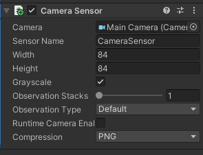

# Reinforcement Learning Model for Hack and Slash Game

The following is the code & reproducability instructions for the model training & game. 

## Overview & Code Summary

- [Here](https://drive.google.com/file/d/1VAcqku52l6gcGUWU2Xc7STchCXoqdkuX/view?usp=sharing) is a screen recording of an inference run of the Vector+CNN model in Unity that showcases the Episode Reward at the end. 
- The [Scripts/](Scripts/) folder contains all scripts used in the game. Most relevant:
  - [PlayerCharacterAgent.cs](Scripts/PlayerCharacterAgent.cs): All code for the agent (observations, actions, heaursitics).
  - [HealthDamageController.cs](Scripts/HealthDamageController.cs): Rewards for the agent (enemies dying, player dying, taking damage).
- [config.yaml](config.yaml) is an example of a hyperparameter config file for Unity Ml-agents.
- [notebook.ipynb](notebook.ipynb) is an exmaple of a notebook I ran for one of the models.
- [This](https://drive.google.com/file/d/1bEyuaE3RZvHLvkdvwxkkakb-djMVO6WX/view?usp=sharing) is the link to the full unity environment in case its needed.

## Observations

Defining observations in Unity is the only challenging/unique thing compared to others, so this section will outline some details.

### Vector observations

The main observations of the model were vector observations from the game:
- Player position (x,y), one-hot encoded state (canMove, isAttacking, isDashing, isCasting), health, direction walking (x,y) - 9 obs
- For the 5 closest health hitboxes: position (x,y), health, one-hot encoded hitbox type (enemy1, enemy2, enemy3, none) - 7 * 5 = 35 obs
- For the 5 closest attack hitboxes: position (x,y), one-hot encoded hitbox type (enemy1, enemy2, volley, none) - 6 * 5 = 30 obs

Total = 74 observations. These are all defined in `CollectObservations()` in [PlayerCharacterAgent.cs](Scripts/PlayerCharacterAgent.cs).

### Image Observations

For this, a simple Camera Sensor compnenet needs to be defined. The follwing is the one used:



## Training Instructions

- Build the game into a Linux executable
- Upload the built EXECUTABLE & UnityPLayer.so into a colab environment 
- Define a .yaml CONFIG file with the training config. The following is an example of the CNN model:
```
behaviors:
  PlayerAgent:
    trainer_type: ppo
    hyperparameters:
      batch_size: 128
      buffer_size: 2048
      learning_rate: 2.0e-4
      beta: 1.0e-3 
      epsilon: 0.2 
      lambd: 0.95 
      learning_rate_schedule: linear
      beta_schedule: constant
      epsilon_schedule: linear
    network_settings:
      normalize: true
      hidden_units: 128
      num_layers: 3
    reward_signals:
      extrinsic:
        gamma: 0.99
        strength: 1.0
      curiosity:
        strength: 0.1
        gamma: 0.99
    max_steps: 600000
    time_horizon: 1000
    summary_freq: 5000
```
- Run the following code to run the training procedure. This will run with 3 instances simultaneously, on GPU (cuda), and without attempting to render graphics:
```
!pip install mlagents
!chmod -R 755 /content/<EXECUTABLE>.x86_64
!chmod -R 755 /content/UnityPlayer.so
!mlagents-learn <CONFIG>.yaml --env=<EXECUTABLE> --run-id=<RUN-ID> --torch-device=cuda --num-envs=3 --no-graphics
```
